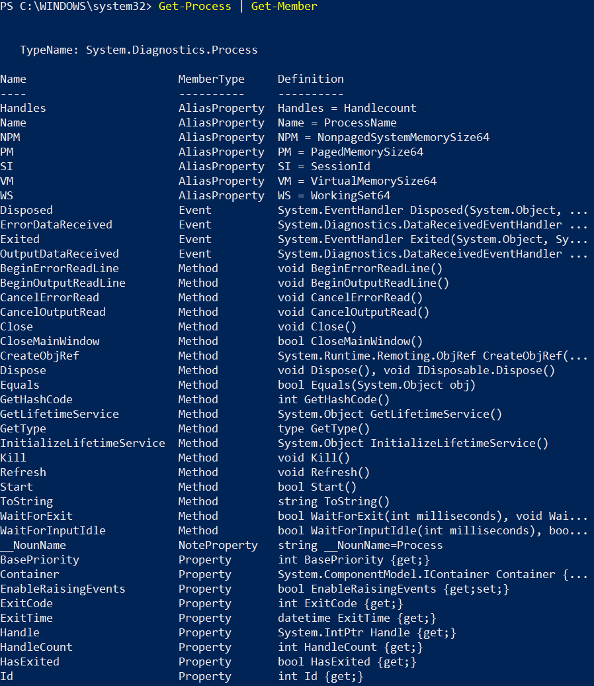

# ЛАБОРАТОРНАЯ РАБОТА №12,13. WindowsPowerShell

**Цель работы**: научиться использованию ключевых возможностей WindowsPowerShell для выполнения различных
административных задач.

<a/>4. Примеры ввода команд.

a. Выполните команду: PSC:>Get-Command На экран будет выведен список всех встроенных команд.


b. Просмотрите список всех сервисов, запущенных на вашем компьютере, исполнив команду:

```powershell
Get-Service
```


c. Просмотрите список всех процессов, запущенных в настоящий момент на вашем компьютере, исполнив команду:

```powershell
Get-Process
```


d. Для получения информации только об одном процессе в качестве аргумента команды Get-Process задается имя этого
процесса.

*ps* или *gps* являются alias`ами для *get-process*

```powershell
Get-Process explorer
```


Для получения информации обо всех запущенных процессах, начинающихся на символ "w":

```powershell
Get–Process w*
```


e. При наборе команд вручную предусмотрена возможность автодополнения с помощью TAB. Для этого нужно ввести необходимый
минимум символов команды и нажать TAB. Напр., Get- + TAB выдаст Get-Acl. Повторные нажатия TAB выдадут следующие по
алфавиту возможные варианты. Чем больше введено символов команды, тем точнее автодополнение.


f. Некоторые команды по умолчанию имеют короткие алиасы. Напр., ps = Get-Process. Полный список алиасов можно получить,
набрав alias:


Полный список алиасов можно получить, набрав alias, конкретный алиас: alias ps


Для поиска строки, содержащей нужное слово или часть можно использовать конвеер: alias | findstr "Item".


<a\>5. Форматирование вывода.

a. Выполните команду:

```powershell
PSC:> Get-Process i* | format-list
```


Для получения подробной информации о различных форматах можно использовать следующую команду:

```powershell
PSC:> Help format*
```


Другие возможные форматы:

```powershell
PSC:> Get-Process i* | format-wide
PSC:> Get-Process i* | format-custom
```


Выполняя команды, мы всегда получаем объекты, а у объектов есть свойства. Просмотрите все свойства объекта, полученного
при выполнении команды Get-Process используя следующую команду:

```powershell
PSC:> Get-Process | Get-Member
```



Поскольку на выходе всегда получается объект, можно манипулировать им для выполнения дополнительных операций. Выполните
операцию фильтрации, исполнив команду:

```powershell
PSC:> Get-Process | where{ $_.handlecount -gt 400 }
```


b. Выполните операцию сортировки, исполнив команду:

```powershell
PSC:> Get-Process | where{ $_.handlecount -gt 400 } | sort-object Handles
```


c. Выполним команду

```powershell
Get-Process|Get-Member Company
```


При форматировании по умолчанию невозможно получить желаемые данные. Преобразуем полученную команду в:

```powershell
PSC:> Get-Process|Get-Member Company|Format-List
PSC:> Get-Process|sort-objectCompany|format-table-GroupCompany name, description, handles
```


Сортировка объектов по свойству WS (workingset) и выбор 5 процессов, занимающих больше всего памяти:

```powershell
PSC:> Get-Process | sort-object –property WS–descending | select-object -first 5
```


d. Завершение процесса. Команда stop-process позволяет остановить запущенный процесс. Запустите Notepad на виртуальной
машине. Выполните команду:

```powershell
PSС:> Get-Processnotepad|Stop-Process
```


Окно Блокнота закроется. Снова запустите Notepad. Такая возможность не всегда является безопасной, поэтому лучше
использовать подобные команды с опцией-whatif, которая показывает, что произойдет при выполнении той или иной команды,
но на самом деле команда не выполняется:

```powershell
PSC:>Get-Processnotepad|Stop-Process–whatif
PSC:>Get-Processnotepad|Stop-Process–confirm
```


e. Запустим "Блокнот": ```PS C:\>notepad``` и найдем этот процесс ```PS C:\> ps notepad``` Получим список методов,
используемых этим процессом: ```PS C:\> ps notepad | Get-Member```


Для применения к выбранному процессу одного из перечисленных методовили получения свойств используем следующую
конструкцию (напр. принудительно завершить процесс):```PS C:\> (ps notepad).Kill()```. Таким образом, применяя выбранные
методы к процессу можно получить подробнейшую информацию о нем, также управлять им.


f. Узнать какой файл запустил тот или иной процесс можно с помощью команды:

```powershell
ps notepad| ls
```

<a/> 6.
Прежде всего, посмотрите текущий статус политики выполнения с помощью команды:

```powershell
get-extensionpolicy
```

В зависимости от специфики выполняемых серверами задач рекомендуется использовать RemoteSigned, в случаях, когда
выполняются преимущественно сценарии собственного написания, и AllSigned, когда выполняются сценарии, полученные из
внешних источников. Для нашего упражнения устанавливаем статус политики Unrestricted либо RemoteSigned:

```powershell
Set-ExecutionPolicy Unrestricted
```

Но после окончания тестирования не забудьте снова включить данную опцию с помощью следующей команды:

```powershell
Set–ExecutionPolicy AllSigned
```


<a/> 7. Работа с файловой системой

a. Создадим новый подкаталог TextFiles в текущем каталоге:

```powershell
new-item TextFiles -itemtype directory
```

В сокращённом виде:

```powershell
ni TextFiles -itemtype directory
```


b. Создайте несколько новых файлов в текущем каталоге demo1.txt, demo2.txt, demo3.txt.

```powershell
for ($i = 0; $i -lt 3; $i++) {
    ni demo$i.txt -itemtype file
}
```


c. Скопируйте все файлы с расширением *.txt в подкаталог TextFiles, используя команду Copy -Item(алиасы -cpi,cp,сору).

```powershell
cp -path '.\*.txt' -destination '.\TextFiles'
```


d. После выполнения команды копирования мы используем команду set -location для перехода в подкаталог TextFiles:

```powershell
sl TextFiles
```

e. С помощью команды rename -item переименовываем файл demo1.txt в demo1.bak. При необходимости можно применять опции
-path и -newName:

```powershell
rni demo1.txt demo1.bak
```


f. После того как файл переименован, переносим его на один уровень вверх, используя команду move-item:

```powershell
mi demo.bak ..\
```


g. Затем применяем команду set -location, а точнее- ее алиас sl для перехода в другой каталог:

```powershell
sl ..
```


h. Манипуляции с файловой системой мы завершаем удалением всего каталога TextFiles, используя команду remove-item.
Поскольку в каталоге TextFiles содержатся файлы, применяется опция -recurse. Если эта опция не указана, Windows
PowerShell запросит подтверждение перед выполнением команды remove -item.

```powershell
rm TextFiles -recurse
```


Для вывода содержимого файлов с расширением BAK в текущей директории:

```powershell
ls -filter "*.bak" | Get-Content
```


Задания

<a/>1. С помощью окружения PowerShell создайте произвольную папку. Перейдите в новую папку. Создайте в ней файл
OUT1.txt, содержащий информацию обо всех запущенных на компьютере процессах (вывод команды ps).

```powershell
ni love_create_folder -itemtype directory
cd love_create_folder
ps > 1.txt
ls
type 1.txt
```


<a/>2. С помощью окружения PowerShell запустите процесс Wordpad. С помощью методов этого процесса получите следующую
информацию Session Id, номер процесса (Handle), используемые системные библиотеки (Modules). Выведите эту информацию в
файл OUT2.txt предварив каждый вывод заголовком (название соответствующего свойства).

```powershell
wordpad
echo "SessionID" > out2.txt
(ps wordpad).SI >> out2.txt
echo "Handle" >> out2.txt
(ps wordpad).Handle >> out2.txt
echo "Modules" >> out2.txt
(ps wordpad).Modules >> out2.txt
cat out2.txt
```


<a/>3. С помощью окружения PowerShell создайте папки FOLDER1, FOLDER2. В FOLDER1 создайте 4 произвольных текстовых
файла. Осуществите копирование этих файлов в FOLDER2 с заменой расширения txt на bak.

```powershell
ni FOLDER1 -itemtype directory
ni FOLDER2 -itemtype directory
sl FOLDER1
ni one.txt -itemtype file
echo " " > two.txt
ni three.txt -itemtype file
ni four.txt -itemtype file
sl ..
cp -path ".\FOLDER1\*.txt" -destination ".\FOLDER2"
sl FOLDER2
ls *.txt | rni -newname { $_.name -replace '.txt', '.bak' }
ls
```


<a/>4. Напишите скрипт PS1, выполняющий все команды в задании 3. Перед выполнением скрипта удалите все предыдущие результаты.

Скрипт:

```powershell
ni FOLDER1 -itemtype directory
ni FOLDER2 -itemtype directory
sl FOLDER1
ni one.txt -itemtype file
echo " " > two.txt
ni three.txt -itemtype file
ni four.txt -itemtype file
sl ..
cp -path ".\FOLDER1\*.txt" -destination ".\FOLDER2"
sl FOLDER2
ls *.txt | rni -newname { $_.name -replace '.txt', '.bak' }
sl ..
```

Запущенный код:

```powershell
Set-ExecutionPolicy Unrestricted
.\PS1.ps1
dir FOLDER2
```


<a/>5. Напишите скрипт, выполняющий команды в задании №2, используя вместо echo командлет Add-Content. Примеры
использования смотреть по справке команды. Определите, алиасом какой команды является echo


Скрипт:

```powershell
wordpad
Set-Content .\OUT2.txt -Value "SessionID" # Нужно для перезаписи файла
Add-Content .\OUT2.txt -Value (ps wordpad).SI

ac .\OUT2.txt -Value "Handle"
ac .\OUT2.txt -Value (ps wordpad).Handle

ac .\OUT2.txt -Value "Modules"
foreach ($item in (ps wordpad).Modules) # Так как возвращается коллекция
{
    ac .\OUT2.txt -Value $item
}
cat out2.txt
(ps wordpad).Kill()
```

Запущенный код:

```powershell
.\PS2.ps1
```


